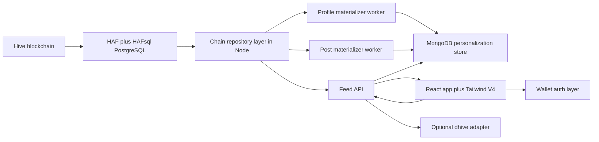

# Hive For You Feed Technical Specification

## Overview

This document defines a full technical specification for a personalized For You feed on Hive.

The goal is to add a feed that feels native to Hive, but is personalized per account instead of being purely global like hot, trending, or other shared rankings. The feed should learn from on-chain behavior and from app-local feedback, then rank posts that are most relevant to each viewer.

The recommended architecture uses HAF and HAFsql as the chain data layer, Node.js with TypeScript for the API and workers, MongoDB for app-specific personalization state, and React with Tailwind V4 for the web experience.

The key design choice is simple:

- HAF and HAFsql remain the source of truth for Hive content and on-chain relationships
- MongoDB stores derived, user-specific state that does not belong on chain
- the ranking engine is deterministic, inspectable, and cheap to operate
- block distance is used for freshness and decay, so the system stays chain-native and does not need wall clock logic for ranking

## Product goals

### Primary goals

- Provide every signed-in Hive user with a personalized home feed
- Learn from follows, community subscriptions, votes, comments, reblogs, authored posts, opened posts, and explicit feedback
- Blend relevance, discovery, quality, and diversity
- Respect mutes, blacklists, gray or hidden content, and user content preferences
- Explain why a post was shown
- Keep the system cheap enough to run without GPU infrastructure, vector databases, or heavy ML services
- Keep ranking logic understandable and configurable

### Secondary goals

- Make the feed improve automatically as the account uses Hive
- Allow explicit correction via controls like hide post, less from this author, more like this tag, and reset personalization
- Keep the feed stable enough for pagination while still reacting to new chain data
- Allow future upgrades to collaborative filtering or learned ranking without changing the public API

### Non goals

- Replacing existing hot or trending feeds
- Writing personal preference state to chain
- Requiring embeddings, LLMs, or recommendation SaaS products
- Building a generic search engine
- Treating replies as first-class feed items in the main For You stream

## Product rules

The feed should follow these product rules:

1. The primary For You stream contains top-level posts only.
2. Replies, votes, comments, reblogs, follows, and subscriptions act as ranking signals, not as standalone feed items in the main stream.
3. Reblogs may boost the original post, but the original post is what is rendered.
4. A user must be able to understand the top reason a post appeared.
5. A user must be able to directly suppress a post, author, tag, or community from the feed.
6. Existing global Hive feeds stay available and can also act as exploration sources for For You.

## Recommended architecture



## Why this architecture

HAF already gives a push-based PostgreSQL view of Hive data and is designed to cope with forks. HAFsql can expose derived domains such as follows, communities, comments, reblogs, rewards, reputations, and more. That means the expensive part, chain indexing and social data extraction, is already solved.

MongoDB should not duplicate the whole chain. It should only store state that is specific to the personalized product:

- user affinity vectors
- explicit feedback overrides
- seen history
- feed snapshots for stable pagination
- app-local interactions such as impressions and opened posts
- optional similar-user neighborhood data

This keeps the architecture cheap and clean:

- PostgreSQL handles chain-shaped queries and joins
- MongoDB handles per-user mutable recommendation state
- Node orchestrates both without introducing more infrastructure than needed

## High level components

### 1. Chain repository layer

A TypeScript repository layer wraps HAF and HAFsql access. The rest of the application must not know raw table names. This is important because HAFsql schemas can vary by installed version or deployment layout.

Responsibilities:

- expose normalized post queries
- expose follow and community relationship queries
- expose recent chain events for profile materialization
- expose head block and irreversible block markers
- expose safety and moderation related lookups

### 2. Feed API

A read-heavy Node service that:

- authenticates the viewer account
- loads the user profile from MongoDB
- fetches candidate posts from PostgreSQL
- computes features
- scores and reranks candidates
- returns stable paginated snapshots
- receives feedback and interaction events

### 3. Profile materializer worker

A Node worker that reads on-chain events from HAF and updates user profiles in MongoDB.

Responsibilities:

- walk irreversible block ranges
- parse events into feature updates
- update author, tag, community, thread, app, and language affinities
- maintain block-based decay
- maintain optional similar-user neighborhoods

### 4. Post materializer worker

A Node worker that maintains a compact post cache in MongoDB for fast ranking and rendering.

Responsibilities:

- normalize top-level posts
- compute derived format flags
- keep lightweight quality features current
- write post-level records keyed by postKey

### 5. Web client

A React app with Tailwind V4 that:

- renders the For You route
- requests paginated feed snapshots
- logs impressions and interactions
- lets the user give explicit feedback
- shows a compact explanation for each recommendation

### 6. Optional dhive adapter

dhive is useful as a thin optional adapter, not the primary ranking data source.

Use it for:

- signature verification if your auth flow uses wallet signatures
- rare RPC fallback reads when a field is missing from HAFsql
- profile or discussion hydration when you want parity with existing Hive RPC output

Do not use dhive as the hot path for candidate generation or ranking. The hot path should stay on indexed PostgreSQL data.

## Domain model

### Feed item

A feed item is the rendered representation of a top-level post plus recommendation context.

```ts
type FeedItem = {
  postKey: string
  author: string
  permlink: string
  title: string
  bodyPreview: string
  community?: string
  tags: string[]
  image?: string
  app?: string
  language?: string
  stats: {
    positiveVotes: number
    negativeVotes: number
    children: number
    authorReputation?: number
    pendingPayout?: number
    hide: boolean
    gray: boolean
    promoted?: number
  }
  context: {
    reasonCodes: ReasonCode[]
    sourceSet: CandidateSource[]
    rebloggedBy?: string[]
  }
}
```

### Normalized post

```ts
type NormalizedPost = {
  postKey: string
  author: string
  permlink: string
  rootKey: string
  depth: number
  community?: string
  tags: string[]
  title: string
  body: string
  bodyPreview: string
  image?: string
  app?: string
  language?: string
  createdBlock: number
  format: {
    imageHeavy: boolean
    longform: boolean
    discussion: boolean
    linkPost: boolean
    video: boolean
  }
  stats: {
    positiveVotes: number
    negativeVotes: number
    children: number
    netRshares?: string
    pendingPayout?: number
    authorReputation?: number
    hide: boolean
    gray: boolean
    promoted?: number
  }
}
```

### User profile

```ts
type EntityScore = {
  key: string
  score: number
  positive: number
  negative: number
  exposureCount: number
  lastBlock: number
}

type UserProfile = {
  account: string
  profileVersion: number
  sourceBlock: number
  topAuthors: EntityScore[]
  topTags: EntityScore[]
  topCommunities: EntityScore[]
  topThreads: EntityScore[]
  topApps: EntityScore[]
  topLanguages: EntityScore[]
  contentPrefs: {
    imageHeavy: number
    longform: number
    discussion: number
    linkPost: number
    video: number
  }
  settings: {
    includeNsfw: boolean
    includeReblogs: boolean
    exploreRatio: number
  }
  counters: {
    impressions: number
    opens: number
    engagedReads: number
    hides: number
  }
}
```

### Candidate sources

```ts
type CandidateSource =
  | 'followed_authors'
  | 'engaged_authors'
  | 'favorite_tags'
  | 'favorite_communities'
  | 'conversation_context'
  | 'reblogs_by_strong_connections'
  | 'similar_users'
  | 'global_exploration'
  | 'global_quality'
```

### Reason codes

```ts
type ReasonCode =
  | 'followed_author'
  | 'engaged_author'
  | 'tag_match'
  | 'community_match'
  | 'thread_match'
  | 'reblogged_by_followed'
  | 'popular_in_interest'
  | 'exploration_pick'
  | 'similar_users'
  | 'recently_active_topic'
```

## Chain data sources and signal mapping

The feed should consume two categories of signals.

### On-chain signals from HAF and HAFsql

1. Follow relationships
2. Community subscriptions and roles
3. Authored posts
4. Replies authored by the viewer
5. Replies received by the viewer
6. Positive votes by the viewer
7. Negative votes by the viewer
8. Reblogs by the viewer
9. Reblogs by followed accounts
10. Tag usage in authored and engaged posts
11. Community usage in authored and engaged posts
12. Author reputation and post quality metrics
13. Mutes, blacklists, and followed mute or blacklist lists
14. Gray or hidden status for posts
15. App metadata from post json_metadata
16. Media and content format hints from post metadata

### App-local off-chain signals

1. Impression
2. Open post
3. Engaged read
4. Open author profile
5. Open community
6. Hide post
7. More like this author
8. More like this tag
9. More from this community
10. Less from this author
11. Less from this tag
12. Less from this community
13. Reset personalization

### Optional alignment with existing Hive API behavior

Even if the personalized feed is built directly from HAF and HAFsql, it is useful to keep parity checks against existing Hive API behavior.

Useful fallback or validation sources:

- ranked global pools comparable to trending, hot, or created
- account-centric pools comparable to blog, feed, posts, replies, or payout views
- community subscription and relationship lookups
- mute, blacklist, and followed-list lookups

This is useful for:

- validating that your normalized helper views match user-visible Hive behavior
- seeding global exploration pools
- smoke testing profile and relationship interpretation

### Signal weighting model

Every signal contributes to one or more feature namespaces. Seed defaults should be stored in config, not hard coded inside business logic.

| Signal | Base weight | Feature targets |
| --- | ---: | --- |
| Follow author | 8.0 | author |
| Subscribe community | 7.0 | community |
| Positive comment on post | 6.0 | author, tags, community, thread |
| Reblog post | 5.5 | author, tags, community |
| Positive vote | 4.0 | author, tags, community |
| Open post | 2.0 | author, tags, community |
| Engaged read | 3.0 | author, tags, community |
| Open community | 1.5 | community |
| Open author profile | 1.5 | author |
| Negative vote | -5.0 | author, tags, community |
| Hide post | -8.0 | exact post, author, tags, community |
| Less like author | -10.0 | author |
| Less like tag | -8.0 | tag |
| Less like community | -8.0 | community |
| More like author | 6.0 | author |
| More like tag | 5.0 | tag |
| More like community | 5.0 | community |

### Signal distribution across namespaces

When a signal targets a post, distribute it like this:

- author gets full allocation
- community gets strong allocation if present
- tags split a shared allocation across normalized tags
- thread gets allocation only for comment, reply, or open actions
- app gets a small allocation
- language gets a small allocation
- content format flags get a small allocation

Example allocation:

```ts
const signalAllocation = {
  author: 1.0,
  community: 0.9,
  tagsShared: 0.8,
  thread: 0.5,
  app: 0.2,
  language: 0.2,
  format: 0.2,
}
```

If a post has multiple tags, split the tagsShared weight across tags with a damping factor:

```ts
const tagWeight = signalAllocation.tagsShared / Math.sqrt(tagCount || 1)
```

This avoids one post with many tags from spraying too much weight.

## Block-based decay model

The ranking system should avoid wall clock dependence and use block distance for recency and decay.

### Event decay

For any feature score:

```ts
function decayScore(score: number, blocksSinceLastUpdate: number, decayBlocks: number) {
  if (decayBlocks <= 0) return score
  return score * Math.exp(-blocksSinceLastUpdate / decayBlocks)
}
```

### Feature update

```ts
function applyFeatureUpdate(current: EntityScore, delta: number, currentBlock: number, decayBlocks: number): EntityScore {
  const decayedScore = decayScore(current.score, currentBlock - current.lastBlock, decayBlocks)
  const normalizedDelta = delta / Math.sqrt(1 + current.exposureCount)
  return {
    ...current,
    score: clamp(decayedScore + normalizedDelta, -20, 20),
    exposureCount: current.exposureCount + 1,
    lastBlock: currentBlock,
    positive: delta > 0 ? current.positive + 1 : current.positive,
    negative: delta < 0 ? current.negative + 1 : current.negative,
  }
}
```

### Decay configuration

Use different decay spans by signal type. Strong social commitments like following or explicit boosts can have weak or no decay. Softer interactions like opens should decay faster.

```ts
const decayBlocks = {
  follow: 0,
  subscribeCommunity: 0,
  comment: 260000,
  reblog: 220000,
  positiveVote: 180000,
  openPost: 120000,
  engagedRead: 160000,
  hide: 320000,
  explicitSuppression: 0,
  explicitBoost: 0,
}
```

## Content normalization

Every feedable post should go through normalization before it enters the ranking engine.

### Normalization rules

1. Feedable items are depth 0 posts only.
2. Normalize postKey as author/permlink.
3. Normalize rootKey as root_author/root_permlink.
4. Normalize community to a single canonical field.
5. Lowercase and dedupe tags.
6. Truncate bodyPreview for feed cards.
7. Extract first image from metadata if available.
8. Parse app from metadata.app.
9. Detect language from metadata if present, else lightweight detector.
10. Derive format booleans:
    - imageHeavy
    - longform
    - discussion
    - linkPost
    - video
11. Compute quality helpers:
    - positiveVotes
    - negativeVotes
    - children
    - reputation
    - rshares
    - gray or hidden state

### Recommended format heuristics

```ts
function deriveFormat(post: { body: string; title: string; image?: string; tags: string[]; app?: string }) {
  const bodyLength = post.body.length
  const hasImage = Boolean(post.image)
  const lowerTags = new Set(post.tags.map(t => t.toLowerCase()))
  const isVideo = lowerTags.has('video') || lowerTags.has('3speak') || post.app?.includes('3speak') || false
  const isLinkPost = /https?:\/\//.test(post.body) && bodyLength < 800
  return {
    imageHeavy: hasImage && bodyLength < 4000,
    longform: bodyLength >= 4000,
    discussion: bodyLength < 2500 && post.title.trim().endsWith('?'),
    linkPost: isLinkPost,
    video: isVideo,
  }
}
```

## PostgreSQL integration design

The application should not query raw HAF tables directly from feature code. Instead, create a dedicated PostgreSQL schema for the feed, with stable views and helper queries.

Recommended schema name:

- for_you_pg

Recommended views:

1. for_you_pg.posts_v
2. for_you_pg.post_tags_v
3. for_you_pg.follow_edges_v
4. for_you_pg.community_subscriptions_v
5. for_you_pg.reblogs_v
6. for_you_pg.user_chain_events_v
7. for_you_pg.author_stats_v
8. for_you_pg.community_stats_v

The exact SQL behind these views can adapt to the installed HAFsql layout.

### Minimal repository interface

```ts
interface ChainRepository {
  getHeadBlock(): Promise<number>
  getIrreversibleBlock(): Promise<number>

  getFollowedAuthors(account: string): Promise<string[]>
  getSubscribedCommunities(account: string): Promise<string[]>

  getRecentPostsByAuthors(authors: string[], limit: number): Promise<NormalizedPost[]>
  getRecentPostsByCommunities(communities: string[], limit: number): Promise<NormalizedPost[]>
  getRecentPostsByTags(tags: string[], limit: number): Promise<NormalizedPost[]>
  getRecentPostsByRootKeys(rootKeys: string[], limit: number): Promise<NormalizedPost[]>
  getRecentReblogsByAuthors(authors: string[], limit: number): Promise<Array<{ postKey: string; by: string }>>

  getGlobalTrending(limit: number): Promise<NormalizedPost[]>
  getGlobalHot(limit: number): Promise<NormalizedPost[]>
  getGlobalCreated(limit: number): Promise<NormalizedPost[]>

  streamUserEvents(fromBlock: number, toBlock: number): AsyncIterable<ChainEvent>
}
```

### Example candidate query shape

The following SQL is illustrative only. Adapt names to your local HAFsql schema or helper views.

```sql
select
  p.post_key,
  p.author,
  p.permlink,
  p.community,
  p.tags,
  p.created_block,
  p.positive_votes,
  p.negative_votes,
  p.children,
  p.author_reputation,
  p.hide,
  p.gray
from for_you_pg.posts_v p
join for_you_pg.follow_edges_v f
  on f.following = p.author
where f.follower = $1
  and p.depth = 0
  and p.author <> $1
order by p.created_block desc
limit $2;
```

### Exploration source query

```sql
select
  p.post_key,
  p.author,
  p.permlink,
  p.community,
  p.tags,
  p.created_block
from for_you_pg.posts_v p
where p.depth = 0
  and p.hide = false
  and p.gray = false
order by p.global_quality desc, p.created_block desc
limit $1;
```

## MongoDB collections

MongoDB stores mutable, user-specific product state.

### 1. user_profiles

```ts
type UserProfileDoc = {
  _id: string
  profileVersion: number
  sourceBlock: number
  topAuthors: EntityScore[]
  topTags: EntityScore[]
  topCommunities: EntityScore[]
  topThreads: EntityScore[]
  topApps: EntityScore[]
  topLanguages: EntityScore[]
  contentPrefs: {
    imageHeavy: number
    longform: number
    discussion: number
    linkPost: number
    video: number
  }
  settings: {
    includeNsfw: boolean
    includeReblogs: boolean
    exploreRatio: number
  }
  counters: {
    impressions: number
    opens: number
    engagedReads: number
    hides: number
  }
}
```

### 2. preference_overrides

Explicit user choices should be stored separately from the learned profile.

```ts
type PreferenceOverrideDoc = {
  _id: string
  account: string
  entityType: 'post' | 'author' | 'tag' | 'community'
  entityKey: string
  mode: 'suppress' | 'boost'
  strength: number
  source: 'user_action' | 'moderation_rule'
}
```

### 3. user_seen_posts

```ts
type UserSeenPostDoc = {
  _id: string
  account: string
  postKey: string
  firstSeenBlock: number
  lastSeenBlock: number
  seenCount: number
  opened: boolean
  hidden: boolean
}
```

### 4. post_feature_cache

```ts
type PostFeatureCacheDoc = {
  _id: string
  author: string
  permlink: string
  rootKey: string
  depth: number
  community?: string
  tags: string[]
  app?: string
  language?: string
  createdBlock: number
  format: {
    imageHeavy: boolean
    longform: boolean
    discussion: boolean
    linkPost: boolean
    video: boolean
  }
  stats: {
    positiveVotes: number
    negativeVotes: number
    children: number
    netRshares?: string
    pendingPayout?: number
    authorReputation?: number
    hide: boolean
    gray: boolean
    promoted?: number
  }
  derived: {
    quality: number
    creatorQuality: number
    communityQuality: number
  }
}
```

### 5. feed_snapshots

```ts
type FeedSnapshotDoc = {
  _id: string
  account: string
  profileVersion: number
  headBlock: number
  items: Array<{
    postKey: string
    score: number
    reasonCodes: ReasonCode[]
    sourceSet: CandidateSource[]
  }>
}
```

### 6. interaction_events

```ts
type InteractionEventDoc = {
  _id: string
  account: string
  event: InteractionEventType
  postKey?: string
  entityKey?: string
  entityType?: 'author' | 'tag' | 'community'
  snapshotId?: string
  slot?: number
  headBlock: number
}
```

### 7. worker_cursors

```ts
type WorkerCursorDoc = {
  _id: 'profile_materializer' | 'post_materializer' | 'similarity_worker'
  lastIrreversibleBlock: number
  revision: number
}
```

### 8. similar_users

Optional collection for collaborative filtering.

```ts
type SimilarUsersDoc = {
  _id: string
  sourceBlock: number
  neighbors: Array<{
    account: string
    score: number
  }>
}
```

### Recommended indexes

```ts
const mongoIndexes = {
  user_profiles: [
    { _id: 1 },
  ],
  preference_overrides: [
    { account: 1, entityType: 1, entityKey: 1, mode: 1 },
  ],
  user_seen_posts: [
    { account: 1, postKey: 1 },
    { account: 1, lastSeenBlock: -1 },
  ],
  post_feature_cache: [
    { _id: 1 },
    { author: 1, createdBlock: -1 },
    { community: 1, createdBlock: -1 },
    { tags: 1, createdBlock: -1 },
  ],
  feed_snapshots: [
    { account: 1, profileVersion: -1, headBlock: -1 },
  ],
  interaction_events: [
    { account: 1, headBlock: -1, event: 1 },
  ],
  worker_cursors: [
    { _id: 1 },
  ],
  similar_users: [
    { _id: 1 },
  ],
}
```

## Fork-safe materialization strategy

MongoDB cannot automatically rewind when Hive reorgs happen. HAF can, but only for state maintained inside HAF-managed PostgreSQL tables.

To keep the architecture cheap and reliable:

1. The profile materializer and post materializer should only persist durable updates from irreversible blocks.
2. The feed request path may still read very recent chain state directly from PostgreSQL for freshness.
3. Ephemeral head-state reads should never be written into durable Mongo profile state until those blocks are irreversible.

This gives you:

- no Mongo rollback complexity
- safe recommendation state
- fresh candidate retrieval

If later you want reversible app-local state, create a PostgreSQL sidecar schema registered with HAF, then mirror its settled output into MongoDB.

## User profile seeding

A personalized feed must work even before enough app-local events exist.

### Initial seed order

For an account with no Mongo profile, seed in this order:

1. Followed authors
2. Subscribed communities
3. Tags from authored posts
4. Communities from authored posts
5. Authors the user has commented on
6. Authors the user has voted on
7. Global quality plus exploration fallback

### Seed strategy

- follow edges become author boosts
- community subscriptions become community boosts
- authored post tags become tag boosts
- authored post communities become community boosts
- existing comments and votes contribute positive affinity
- if the account is still sparse after chain seeding, show onboarding chips for tags and communities

### Seed pseudocode

```ts
async function seedProfile(account: string): Promise<UserProfileDoc> {
  const [followedAuthors, communities, historicalSignals] = await Promise.all([
    chainRepo.getFollowedAuthors(account),
    chainRepo.getSubscribedCommunities(account),
    chainRepo.getHistoricalSeedSignals(account),
  ])

  const profile = emptyProfile(account)

  for (const author of followedAuthors) {
    boostEntity(profile.topAuthors, author, 8, 0)
  }

  for (const community of communities) {
    boostEntity(profile.topCommunities, community, 7, 0)
  }

  for (const signal of historicalSignals) {
    applySignal(profile, signal)
  }

  return profile
}
```

## Candidate generation

Candidate generation should be multi-source. Do not rely on a single source like followed authors only.

### Candidate generation principles

- every source overfetches
- candidates are deduped by postKey
- candidates are merged before final scoring
- a post can carry multiple source hints
- source hints become part of explanation generation

### Source 1: followed authors

Posts authored by accounts the viewer follows.

Good for:

- strong relevance
- immediate familiarity
- cold start

Budget:

- pageSize multiplied by 6

### Source 2: engaged authors

Posts authored by accounts the viewer often comments on, votes on, opens, or reblogs.

Good for:

- personalized affinity beyond formal follows

Budget:

- pageSize multiplied by 4

### Source 3: favorite tags

Posts tagged with the viewer's strongest positive tags.

Good for:

- topic matching
- content discovery beyond the social graph

Budget:

- pageSize multiplied by 6

### Source 4: favorite communities

Posts in communities the viewer subscribes to or strongly engages with.

Good for:

- community-native discovery

Budget:

- pageSize multiplied by 6

### Source 5: conversation context

Top-level posts whose root discussion is related to threads the viewer participated in.

Good for:

- thread continuity
- social conversation relevance

Budget:

- pageSize multiplied by 3

### Source 6: reblogs by strong connections

Original posts reblogged by followed authors or accounts with high author affinity.

Good for:

- social curation
- network expansion

Budget:

- pageSize multiplied by 3

### Source 7: similar users

Posts popular with users who have similar author, tag, and community vectors.

Good for:

- collaborative filtering without embeddings

Budget:

- pageSize multiplied by 4

### Source 8: global exploration

A diversified blend from global trending, hot, created, and quality-ranked posts, filtered by safety and weak topic proximity.

Good for:

- serendipity
- avoiding filter bubbles

Budget:

- pageSize multiplied by 4

### Candidate merge rules

```ts
type Candidate = {
  postKey: string
  post?: NormalizedPost
  sourceSet: Set<CandidateSource>
  sourceScore: number
  rebloggedBy?: string[]
}
```

Merge logic:

1. Deduplicate by postKey.
2. Union sourceSet.
3. Sum a capped sourceScore.
4. Merge rebloggedBy lists.
5. Drop reply-only items.
6. Drop items failing safety filters.

### Candidate merge pseudocode

```ts
function mergeCandidates(sourceBatches: Record<CandidateSource, Candidate[]>): Candidate[] {
  const merged = new Map<string, Candidate>()

  for (const [source, batch] of Object.entries(sourceBatches) as Array<[CandidateSource, Candidate[]]>) {
    for (const item of batch) {
      const existing = merged.get(item.postKey)
      if (!existing) {
        merged.set(item.postKey, {
          ...item,
          sourceSet: new Set([source]),
          sourceScore: item.sourceScore || 1,
        })
        continue
      }

      existing.sourceSet.add(source)
      existing.sourceScore = Math.min(existing.sourceScore + (item.sourceScore || 1), 10)
      if (item.rebloggedBy?.length) {
        existing.rebloggedBy = dedupeStrings([...(existing.rebloggedBy || []), ...item.rebloggedBy])
      }
    }
  }

  return [...merged.values()]
}
```

## Feature extraction

Each candidate must be enriched with per-user and post-level features before scoring.

### Feature groups

1. Author affinity
2. Tag affinity
3. Community affinity
4. Thread affinity
5. App affinity
6. Language affinity
7. Content format affinity
8. Relationship boost
9. Quality score
10. Freshness score
11. Novelty score
12. Exploration bonus
13. Explicit override boost or suppression
14. Diversity penalty
15. Safety penalty

### Feature assembly shape

```ts
type CandidateFeatures = {
  authorAffinity: number
  tagAffinity: number
  communityAffinity: number
  threadAffinity: number
  appAffinity: number
  languageAffinity: number
  formatAffinity: number
  relationshipBoost: number
  qualityScore: number
  freshnessScore: number
  noveltyScore: number
  explorationBonus: number
  overrideBoost: number
  overridePenalty: number
  safetyPenalty: number
  sourcePrior: number
}
```

### Affinity lookups

Use sparse maps from the top entity lists.

```ts
function lookupEntityScore(entities: EntityScore[], key?: string): number {
  if (!key) return 0
  return entities.find(x => x.key === key)?.score || 0
}

function lookupTagAffinity(profile: UserProfileDoc, tags: string[]): number {
  const values = tags
    .map(tag => lookupEntityScore(profile.topTags, tag))
    .sort((a, b) => b - a)
    .slice(0, 3)

  return values.reduce((sum, value) => sum + value, 0)
}
```

### Quality score

Quality should be resistant to manipulation. Use capped transforms.

```ts
function computeQuality(post: NormalizedPost): number {
  const positiveVotes = Math.log1p(Math.max(post.stats.positiveVotes, 0))
  const negativeVotes = Math.log1p(Math.max(post.stats.negativeVotes, 0))
  const children = Math.log1p(Math.max(post.stats.children, 0))
  const reputation = normalize(post.stats.authorReputation || 0, 0, 80)
  const payout = Math.log1p(Math.max(post.stats.pendingPayout || 0, 0))

  return (
    positiveVotes * 0.35 +
    children * 0.25 +
    reputation * 0.2 +
    payout * 0.1 -
    negativeVotes * 0.2
  )
}
```

### Freshness score

Use block distance.

```ts
function computeFreshness(createdBlock: number, headBlock: number): number {
  const blockDistance = Math.max(headBlock - createdBlock, 0)
  return 1 / (1 + Math.log1p(blockDistance))
}
```

### Novelty score

Novelty should reward variety and avoid repeats.

```ts
function computeNovelty(profile: UserProfileDoc, seen: UserSeenPostDoc | null, post: NormalizedPost): number {
  let score = 0

  if (!seen) score += 1
  if (!profile.topAuthors.find(x => x.key === post.author)) score += 0.2
  if (post.community && !profile.topCommunities.find(x => x.key === post.community)) score += 0.15

  return score
}
```

## Ranking algorithm

Start with a weighted linear ranker. It is transparent, fast, and easy to tune. The system can later replace the scoring function without changing the rest of the pipeline.

### Baseline linear scorer

```ts
const rankWeights = {
  sourcePrior: 0.7,
  authorAffinity: 1.3,
  tagAffinity: 1.1,
  communityAffinity: 1.0,
  threadAffinity: 0.8,
  appAffinity: 0.2,
  languageAffinity: 0.2,
  formatAffinity: 0.3,
  relationshipBoost: 1.0,
  qualityScore: 0.9,
  freshnessScore: 1.0,
  noveltyScore: 0.4,
  explorationBonus: 0.35,
  overrideBoost: 1.4,
  overridePenalty: 1.8,
  safetyPenalty: 2.5,
}
```

```ts
function scoreCandidate(features: CandidateFeatures): number {
  return (
    features.sourcePrior * rankWeights.sourcePrior +
    features.authorAffinity * rankWeights.authorAffinity +
    features.tagAffinity * rankWeights.tagAffinity +
    features.communityAffinity * rankWeights.communityAffinity +
    features.threadAffinity * rankWeights.threadAffinity +
    features.appAffinity * rankWeights.appAffinity +
    features.languageAffinity * rankWeights.languageAffinity +
    features.formatAffinity * rankWeights.formatAffinity +
    features.relationshipBoost * rankWeights.relationshipBoost +
    features.qualityScore * rankWeights.qualityScore +
    features.freshnessScore * rankWeights.freshnessScore +
    features.noveltyScore * rankWeights.noveltyScore +
    features.explorationBonus * rankWeights.explorationBonus +
    features.overrideBoost * rankWeights.overrideBoost -
    features.overridePenalty * rankWeights.overridePenalty -
    features.safetyPenalty * rankWeights.safetyPenalty
  )
}
```

### Hard filters before ranking

A candidate must be dropped if any of the following apply:

- the post is hidden
- the post is gray and gray content is configured as excluded
- the post or author is on a manual denylist
- the author is suppressed by explicit user feedback
- the community is suppressed by explicit user feedback
- any tag is suppressed by explicit user feedback
- the exact post is already hidden by the user
- the candidate is already seen and seen repeats are disabled for the current build
- the post is NSFW and the viewer disabled NSFW content
- the candidate is a reply instead of a top-level post

### Safety penalty rules

Even if a post passes hard filters, it may still receive a penalty:

- author has repeated low-quality history
- post has abnormal negative feedback patterns
- post comes from a muted list followed by the viewer
- post quality is below a minimum threshold
- same author has too many recent candidates

## Diversity and reranking

Pure score sorting tends to clump by author, tag, or community. Apply a reranking pass after base scoring.

### Diversity goals

- avoid repeating the same author too often
- avoid repeating the same community too often
- avoid multiple posts from the same root discussion
- preserve a small amount of exploration
- keep strong posts strong, but not monotonous

### Window rules

Seed defaults:

```ts
const diversityRules = {
  authorWindow: 4,
  communityWindow: 3,
  threadWindow: 1,
  explorationEvery: 6,
}
```

### MMR-style reranking

Use a simple maximal marginal relevance approach:

```ts
function similarity(a: NormalizedPost, b: NormalizedPost): number {
  let value = 0
  if (a.postKey === b.postKey) value += 10
  if (a.rootKey === b.rootKey) value += 4
  if (a.author === b.author) value += 2.5
  if (a.community && a.community === b.community) value += 1.2
  value += jaccard(a.tags, b.tags)
  return value
}
```

```ts
function rerankWithDiversity(scored: Array<{ post: NormalizedPost; score: number; sourceSet: Set<CandidateSource> }>): Array<{ post: NormalizedPost; score: number }> {
  const selected: Array<{ post: NormalizedPost; score: number }> = []
  const remaining = [...scored]

  while (remaining.length) {
    let bestIndex = 0
    let bestValue = -Infinity

    for (let i = 0; i < remaining.length; i++) {
      const candidate = remaining[i]
      const redundancyPenalty = selected.reduce((max, chosen) => Math.max(max, similarity(candidate.post, chosen.post)), 0)
      const sourceBonus = candidate.sourceSet.has('global_exploration') ? 0.15 : 0
      const rerankValue = candidate.score - redundancyPenalty * 0.35 + sourceBonus

      if (rerankValue > bestValue) {
        bestValue = rerankValue
        bestIndex = i
      }
    }

    selected.push(remaining.splice(bestIndex, 1)[0])
  }

  return selected
}
```

## Recommendation explanation generation

Every returned item should include compact explanation metadata.

### Explanation rules

Use the top contributing positive reasons only. Never show internal numeric weights to the user.

Priority order:

1. explicit social reason
2. explicit interest reason
3. conversation reason
4. exploration reason
5. popularity reason

### Mapping examples

| Reason code | User-facing text |
| --- | --- |
| followed_author | You follow this author |
| engaged_author | You often interact with this author |
| tag_match | Matches tags you engage with |
| community_match | From a community you follow or engage with |
| thread_match | Related to a discussion you joined |
| reblogged_by_followed | Reblogged by an account close to your network |
| popular_in_interest | Popular within topics you like |
| exploration_pick | Suggested to widen your feed |
| similar_users | Accounts with similar interests engaged with this |
| recently_active_topic | Similar to topics you have been engaging with |

### Explanation selection pseudocode

```ts
function deriveReasons(contributions: Record<ReasonCode, number>): ReasonCode[] {
  return Object.entries(contributions)
    .filter(([, score]) => score > 0)
    .sort((a, b) => b[1] - a[1])
    .slice(0, 2)
    .map(([code]) => code as ReasonCode)
}
```

## Similar users module

This module is optional but recommended. It gives collaborative filtering without embeddings.

### Profile vector

Build a sparse vector per user from:

- topAuthors
- topTags
- topCommunities

### Similarity function

Use weighted Jaccard or cosine on sparse positive features.

```ts
function weightedJaccard(a: Record<string, number>, b: Record<string, number>): number {
  const keys = new Set([...Object.keys(a), ...Object.keys(b)])
  let minSum = 0
  let maxSum = 0

  for (const key of keys) {
    const av = a[key] || 0
    const bv = b[key] || 0
    minSum += Math.min(av, bv)
    maxSum += Math.max(av, bv)
  }

  return maxSum === 0 ? 0 : minSum / maxSum
}
```

### Neighborhood maintenance

The similarity worker:

1. reads updated user profiles
2. builds sparse vectors
3. finds top similar accounts
4. stores them in similar_users
5. candidate generation can then pull posts engaged by neighbors

This is cheap enough for regular batch recomputation and does not require extra services.

## Feed request flow

### Request steps

1. authenticate account
2. load profile from MongoDB
3. get head block from PostgreSQL
4. try to reuse a compatible snapshot
5. if none exists, generate candidates from all enabled sources
6. enrich candidates with post data and features
7. apply hard filters
8. score candidates
9. rerank for diversity
10. save snapshot
11. return first page

### Snapshot reuse rules

A snapshot can be reused when:

- account matches
- profileVersion matches
- headBlock drift is within configured threshold
- no explicit feedback was applied after snapshot creation

Use block drift instead of clock-based expiry.

### Feed build pseudocode

```ts
async function buildForYouFeed(account: string, cursor?: string, pageSize = 25) {
  const profile = await userProfileRepo.getOrSeed(account)
  const headBlock = await chainRepo.getHeadBlock()

  const reusable = await snapshotRepo.findReusable(account, profile.profileVersion, headBlock)
  if (reusable) {
    return paginateSnapshot(reusable, cursor, pageSize)
  }

  const candidateBudget = {
    followedAuthors: pageSize * 6,
    engagedAuthors: pageSize * 4,
    favoriteTags: pageSize * 6,
    favoriteCommunities: pageSize * 6,
    conversationContext: pageSize * 3,
    reblogsByStrongConnections: pageSize * 3,
    similarUsers: pageSize * 4,
    globalExploration: pageSize * 4,
  }

  const sourceBatches = await candidateGenerator.collect(account, profile, candidateBudget)
  const merged = mergeCandidates(sourceBatches)
  const enriched = await featureAssembler.enrich(account, profile, merged, headBlock)
  const filtered = hardFilter(enriched, profile)
  const scored = filtered.map(candidate => ({
    ...candidate,
    score: scoreCandidate(candidate.features),
  }))
  const reranked = rerankWithDiversity(scored)
  const snapshot = await snapshotRepo.save(account, profile.profileVersion, headBlock, reranked)

  return paginateSnapshot(snapshot, cursor, pageSize)
}
```

## Profile materialization flow

### Worker rules

- process irreversible blocks only
- use idempotent updates
- maintain a per-worker cursor in MongoDB
- parse both raw HAF operations and HAFsql derived views where convenient
- store only compact profile summaries, not full historical copies

### Event types to parse

At minimum:

- follow operations
- vote operations
- comment operations
- reblog operations
- community subscribe operations
- authoring events for top-level posts
- moderation or mute related events if available from your selected data source

### Materializer pseudocode

```ts
async function runProfileMaterializer() {
  const cursor = await cursorRepo.get('profile_materializer')
  const irreversibleBlock = await chainRepo.getIrreversibleBlock()

  for await (const event of chainRepo.streamUserEvents(cursor.lastIrreversibleBlock + 1, irreversibleBlock)) {
    await applyChainEventToProfile(event)
  }

  await cursorRepo.update('profile_materializer', irreversibleBlock)
}
```

### Applying a chain event

```ts
async function applyChainEventToProfile(event: ChainEvent) {
  const profile = await userProfileRepo.getOrSeed(event.account)
  const delta = computeSignalDelta(event)

  if (event.author) updateAuthor(profile, event.author, delta, event.blockNum)
  if (event.community) updateCommunity(profile, event.community, delta, event.blockNum)
  if (event.tags?.length) updateTags(profile, event.tags, delta, event.blockNum)
  if (event.rootKey) updateThread(profile, event.rootKey, delta, event.blockNum)
  if (event.app) updateApp(profile, event.app, delta, event.blockNum)
  if (event.language) updateLanguage(profile, event.language, delta, event.blockNum)
  if (event.format) updateFormatPrefs(profile, event.format, delta)

  profile.profileVersion += 1
  profile.sourceBlock = Math.max(profile.sourceBlock, event.blockNum)

  await userProfileRepo.save(profile)
}
```

## Post materialization flow

The post materializer keeps a lightweight cache of posts useful for ranking.

### Materialized post rules

- keep top-level posts only
- normalize tags and community
- compute format flags
- compute derived quality signals
- update stats when new irreversible state lands

### Why materialize posts in Mongo at all

You can rank directly from PostgreSQL only, but a compact Mongo post cache helps when:

- the same post is requested repeatedly
- explanation metadata and body previews are repeatedly needed
- candidate ranking needs quick post lookups after source merging

This cache must stay compact. It is not another copy of HAF.

## REST API specification

The API assumes an authenticated Hive account is available in request context. If you do not already have auth, implement a wallet signature challenge flow separately.

### GET /api/for-you

Returns a paginated personalized feed.

Query params:

- cursor
- pageSize
- refresh

Response shape:

```ts
type ForYouResponse = {
  snapshotId: string
  profileVersion: number
  headBlock: number
  nextCursor?: string
  items: FeedItem[]
}
```

### POST /api/for-you/actions

Records feed interactions and explicit feedback.

```ts
type InteractionEventType =
  | 'impression'
  | 'open_post'
  | 'engaged_read'
  | 'open_author'
  | 'open_community'
  | 'hide_post'
  | 'more_like_author'
  | 'more_like_tag'
  | 'more_like_community'
  | 'less_like_author'
  | 'less_like_tag'
  | 'less_like_community'
  | 'reset_personalization'

type ForYouActionRequest =
  | { event: 'impression'; postKey: string; snapshotId: string; slot: number }
  | { event: 'open_post'; postKey: string; snapshotId: string; slot: number }
  | { event: 'engaged_read'; postKey: string; snapshotId: string; slot: number }
  | { event: 'open_author'; entityKey: string }
  | { event: 'open_community'; entityKey: string }
  | { event: 'hide_post'; postKey: string }
  | { event: 'more_like_author'; entityKey: string }
  | { event: 'more_like_tag'; entityKey: string }
  | { event: 'more_like_community'; entityKey: string }
  | { event: 'less_like_author'; entityKey: string }
  | { event: 'less_like_tag'; entityKey: string }
  | { event: 'less_like_community'; entityKey: string }
  | { event: 'reset_personalization' }
```

Behavior:

- store the action in interaction_events
- update seen history if applicable
- apply immediate explicit override if applicable
- increment profileVersion if the action changes personalization state
- invalidate matching snapshots when needed

### GET /api/for-you/explain/:author/:permlink

Returns a debug-friendly explanation for one feed item.

```ts
type ExplainResponse = {
  postKey: string
  reasons: Array<{
    code: ReasonCode
    text: string
    contribution: number
  }>
  sourceSet: CandidateSource[]
}
```

This endpoint is useful both for UI dialogs and for internal debugging.

### GET /api/for-you/profile

Returns the user's compact recommendation profile.

```ts
type ForYouProfileResponse = Pick<
  UserProfileDoc,
  'profileVersion' | 'sourceBlock' | 'topAuthors' | 'topTags' | 'topCommunities' | 'topLanguages' | 'contentPrefs' | 'settings'
>
```

### POST /api/for-you/reset

Clears MongoDB personalization state and reseeds from chain relationships.

Behavior:

- delete explicit overrides
- delete seen history if desired
- delete snapshots
- reset user profile
- seed again from follows, communities, and authored history

## API implementation notes

### Stable pagination

Use snapshots, not live offset pagination. If the feed is rebuilt between page requests, offset paging will drift badly.

Recommended cursor contents:

- snapshotId
- offset

Encode as opaque base64.

### Refresh behavior

If refresh is true:

- ignore reusable snapshots
- rebuild the feed against the latest compatible head block
- do not drop explicit user suppressions

### Partial failure handling

If one candidate source fails:

- log the failure
- continue with the other sources
- mark source health in debug logging
- never fail the whole feed if at least one strong source succeeded

## Front-end specification

### Route

Create a dedicated route:

- /for-you

The For You page should be a first-class entry next to existing global feed routes.

### Core UI structure

```txt
ForYouPage
  FeedHeader
    Title
    Refresh control
    Personalization settings entry
  FeedList
    FeedCard
      ReasonChip
      PostCard
      FeedbackMenu
  WhyAmISeeingThisDialog
  PersonalizationDrawer
```

### Feed card requirements

Each card should show:

- author
- title
- community if present
- preview image if present
- body preview
- tags
- a compact reason chip
- actions menu

### Actions menu

Required actions:

- Hide post
- Less from this author
- Less from this community
- Less like this tag
- More from this author
- More from this community
- More like this tag
- Why this is shown

### Interaction logging on the client

Log at least:

- impression when a card becomes visible
- open_post when entering the full post route
- engaged_read when the user expands or meaningfully interacts with the card
- explicit feedback actions

engaged_read should be based on interaction depth, not dwell duration. Good triggers are expand, scroll progression within the card, media interaction, or opening the full post.

Do not block the UI on these writes. Fire and forget with retry buffering if needed.

### State management

Recommended stack:

- React Query for feed fetching and mutation state
- existing router for route handling
- local component state for menus and dialogs
- no need for a large global state store unless the rest of the app already uses one

### Infinite scroll

Use IntersectionObserver.

Rules:

- request next page before the current page ends
- dedupe by postKey on the client too
- if a hidden post exists in visible data, remove it optimistically

### Tailwind V4 notes

Use Tailwind utility classes directly. Keep the feed layout simple and readable.

Recommended design choices:

- single main column for feed cards
- optional side rail on wide screens for profile tuning and interest summaries
- subtle reason chip styling
- action menu exposed through an icon button
- skeleton cards while loading

## Personalization controls

The product should let users tune the algorithm directly.

### Required controls

1. Hide this post
2. Show less from this author
3. Show less from this community
4. Show less like this tag
5. Show more from this author
6. Show more from this community
7. Show more like this tag
8. Reset personalization

### How controls affect data

- hide post creates a post-level suppression override and negative signal spillover to author, tag, and community
- less like author creates an author suppression override
- less like community creates a community suppression override
- less like tag creates a tag suppression override
- more actions create boost overrides
- reset removes overrides and rebuilds the learned profile

### Immediate UI behavior

- the hidden item should disappear immediately
- the feed does not need to fully rebuild synchronously on every small action
- use optimistic local removal, then lazily refresh or rebuild the next snapshot

## Moderation, safety, and trust

A personalized feed must be safe and trustworthy.

### Safety requirements

- respect user mutes and blacklists
- respect followed mute or blacklist lists if your product chooses to honor them
- exclude or strongly demote hidden or gray content
- exclude NSFW unless the user enabled it
- cap the effect of social proof metrics to reduce manipulation
- penalize over-repetition from one author
- do not let reblogs flood the feed

### Abuse resistance

Implement these protections:

1. Cap quality boosts with log transforms.
2. Ignore self-vote amplification for ranking quality.
3. Penalize authors posting too many candidate items in the recent block span.
4. Add manual denylist support for authors, tags, communities, and exact posts.
5. Track hide rates per author and per community as optional moderation signals.
6. Keep explanation text honest and tied to actual score contributors.

### Manual moderation override collection

If needed, add:

```ts
type ModerationRuleDoc = {
  _id: string
  entityType: 'post' | 'author' | 'tag' | 'community'
  entityKey: string
  mode: 'deny' | 'demote' | 'boost'
  strength: number
}
```

This is separate from user preference overrides.

## Observability and debugging

Recommendation systems are painful to tune without diagnostics. Build this in from the start.

### Log for every snapshot build

- account
- profileVersion
- headBlock
- source candidate counts
- filtered candidate counts
- top reason distributions
- number of duplicates removed
- top authors in returned page
- top communities in returned page
- algorithm version

### Internal debug endpoints

Recommended internal endpoints:

- GET /internal/for-you/profile/:account
- GET /internal/for-you/feed/:account
- GET /internal/for-you/post/:author/:permlink
- GET /internal/for-you/source-health

### Useful metrics

- feed request success rate
- snapshot reuse rate
- candidate source contribution mix
- hide rate
- open rate
- engaged read rate
- author diversity per page
- community diversity per page
- exploration acceptance rate
- cold-start fill rate

## Testing strategy

### Unit tests

Test these in isolation:

- tag normalization
- format derivation
- decay functions
- feature updates
- candidate merging
- hard filters
- ranking function
- diversity reranker
- explanation generation

### Integration tests

Against a fixed HAF dataset or snapshot:

- followed author candidates are returned
- community candidates are returned
- vote and comment history changes profile weights
- muted or hidden content never leaks
- explicit suppressions override positive affinity
- snapshots stay stable across pagination

### Property tests

Useful invariants:

- no duplicate postKey in a returned page
- no reply item in the main feed
- a suppressed author never appears
- a suppressed community never appears
- negative override must beat weak positive affinity

### End-to-end tests

In the web app:

- feed loads
- infinite scroll appends new items
- hide action removes an item
- explanation dialog opens
- reset personalization triggers reseed

## Deployment layout

A simple deployment layout is enough.

### Services

1. web
2. api
3. profile-materializer worker
4. post-materializer worker
5. optional similarity worker
6. MongoDB
7. HAF and HAFsql PostgreSQL stack

### Node project layout

Recommended monorepo layout:

```txt
apps/
  api/
  worker/
  web/
packages/
  ranking-core/
  chain-repository/
  shared-types/
  shared-config/
  ui/
```

### API package responsibilities

- route handlers
- auth middleware
- snapshot service
- ranking orchestration
- interaction logging

### Worker package responsibilities

- profile materialization
- post materialization
- similarity updates
- cleanup jobs

### Shared package responsibilities

- entity types
- scoring config
- repository interfaces
- utility math
- reason mapping

## Configuration

All weights and budgets must live in config.

```ts
export const forYouConfig = {
  pageSizeDefault: 25,
  candidateBudgets: {
    followedAuthors: 150,
    engagedAuthors: 100,
    favoriteTags: 150,
    favoriteCommunities: 150,
    conversationContext: 75,
    reblogsByStrongConnections: 75,
    similarUsers: 100,
    globalExploration: 100,
  },
  rankWeights,
  decayBlocks,
  diversityRules,
  minimumQualityScore: 0.15,
  maxSourceScore: 10,
  nsfwDefault: false,
  grayContentMode: 'exclude' as const,
}
```

Keep this config versioned and expose the version in logs and snapshots.

## Recommended implementation checklist

### PostgreSQL and chain layer

- create stable helper views in a dedicated PostgreSQL schema
- implement ChainRepository with pg
- expose head block and irreversible block accessors
- expose source queries for authors, tags, communities, reblogs, and global feeds
- expose normalized user event stream

### MongoDB layer

- create collections and indexes
- implement profile repository
- implement snapshot repository
- implement seen history repository
- implement preference override repository

### Ranking engine

- normalize posts
- implement feature lookups
- implement linear scorer
- implement diversity reranker
- implement reason extraction
- implement hard filters

### Workers

- implement profile materializer
- implement post materializer
- implement optional similarity worker
- implement cursor storage and idempotent block processing

### API

- implement GET /api/for-you
- implement POST /api/for-you/actions
- implement GET /api/for-you/explain/:author/:permlink
- implement GET /api/for-you/profile
- implement POST /api/for-you/reset

### Front-end

- add /for-you route
- implement infinite feed query
- implement reason chip
- implement feedback menu
- implement why dialog
- implement personalization drawer
- log impressions and actions

## Acceptance criteria

The feature is ready when all of the following are true:

1. A signed-in Hive account receives a non-empty personalized feed.
2. The feed changes meaningfully based on followed authors, subscribed communities, and engagement history.
3. The feed excludes hidden, suppressed, muted, or disallowed content.
4. The feed pagination is stable across page fetches.
5. A user can hide a post and suppress an author, tag, or community.
6. The system can explain why a post was shown.
7. Cold-start accounts still receive sensible recommendations.
8. The API and workers can recover from restarts using stored block cursors.
9. The ranking config can be tuned without code changes.
10. Debug tools exist to inspect profiles, reasons, and source mixes.

## Final recommendation

Build the first production version as a deterministic, block-aware, multi-source recommendation engine backed by HAF and HAFsql, with MongoDB holding only user-specific recommendation state.

That gives you the right balance:

- cheap to run
- easy to reason about
- native to Hive
- respectful of communities and user controls
- flexible enough to evolve into a stronger recommender later

The most important implementation choices are:

- use PostgreSQL for chain-native retrieval
- use MongoDB for mutable personalization state
- materialize only irreversible chain effects into Mongo
- keep scoring explicit and configurable
- expose explanation and feedback controls from the start
